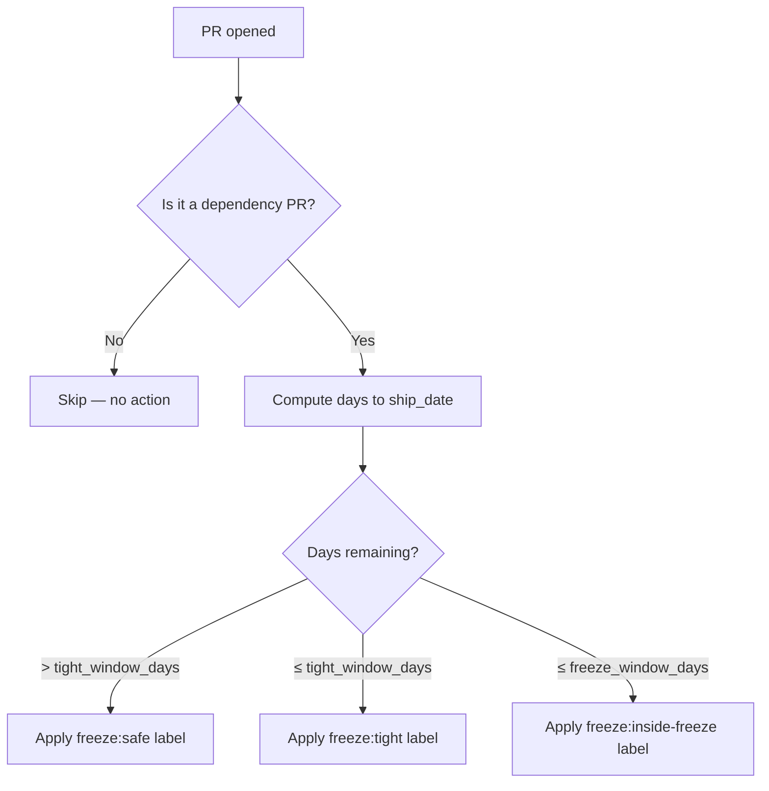
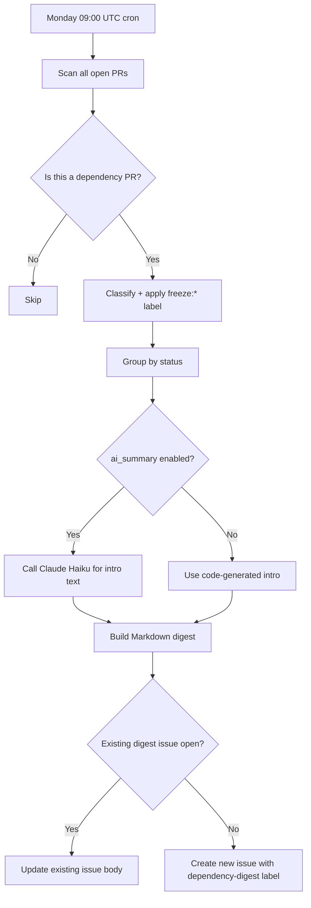
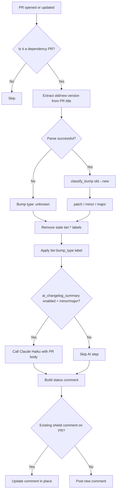
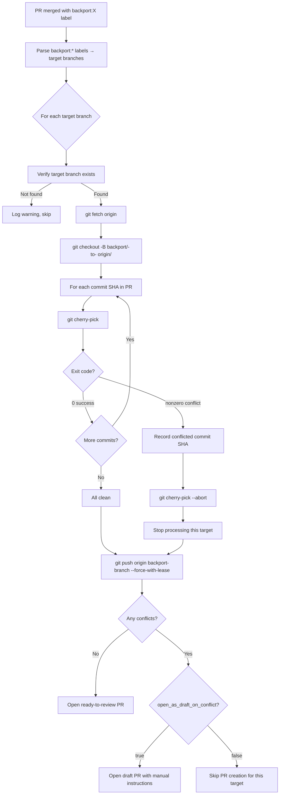

# Architecture — release-dependency-agent

How the three layers are structured, what triggers them, and how they make decisions.

---

## Overview

Each layer is an independent workflow + Python script pair. They share a common helper module (`common.py`) for config loading, GitHub authentication, and semver parsing. Nothing else is shared — you can delete any one layer's files without affecting the others.

```
GitHub Events
     │
     ├─ PR opened/updated ──────► Layer 1 (PR mode) ──► freeze:* label on PR
     │
     ├─ PR opened/updated ──────► Layer 2 ──────────────► tier:* label + status comment
     │
     ├─ PR merged + backport:* ─► Layer 3 ──────────────► backport PR(s) on target branches
     │
     └─ Cron (Monday 09:00 UTC) ► Layer 1 (digest mode) ► GitHub Issue digest
```

---

## Layer 1 — Freeze Window + Early-Warning System

**Files:** `src/freeze_check.py`, `.github/workflows/freeze-window.yml`

### Decision logic

```
days_to_ship = ship_date − today

if days_to_ship ≤ freeze_window_days → freeze:inside-freeze  (default: 10 days)
elif days_to_ship ≤ tight_window_days → freeze:tight          (default: 21 days)
else                                  → freeze:safe
```

### PR trigger flow



### Cron/digest flow



### Detection heuristics

A PR is considered a dependency update if **any** of the following are true:
1. It has a label in the configured `dependency_labels` list (e.g. `dependencies`, `renovate`)
2. The author login contains `dependabot` or `renovate`
3. The title matches the pattern `"from X.Y.Z to A.B.C"`

Three signals with OR logic makes this robust across different Dependabot/Renovate configurations.

---

## Layer 2 — Breaking-Change Shield

**Files:** `src/breaking_change_shield.py`, `.github/workflows/breaking-change.yml`

### Semver classification

```
parse_semver("2.1.3") → (2, 1, 3)

if new_major ≠ old_major → "major"
elif new_minor ≠ old_minor → "minor"
else → "patch"
```

Using `!=` instead of `>` on major/minor catches both upgrades and downgrades. A major version change in either direction warrants scrutiny.

### Tier → requirements mapping

| Tier | Label | CI | Reviewer | Extra requirement |
|---|---|---|---|---|
| patch | `tier:patch` | ✅ required | ❌ | — |
| minor | `tier:minor` | ✅ required | ✅ required | `regression-tested` label must be applied |
| major | `tier:major` | ✅ required | ✅ required | Changelog reviewed + noted in PR comment |
| unknown | `tier:unknown` | ✅ required | ✅ required | — (conservative default) |

### PR flow



### Comment idempotency

Every comment the shield posts contains a hidden HTML marker:
```html
<!-- release-dependency-agent:breaking-change-shield -->
```
On each PR sync event, the script scans existing comments for this marker and edits in place rather than posting a new comment. This prevents comment spam on busy PRs.

---

## Layer 3 — Label-driven Backport Automation

**Files:** `src/backport.py`, `.github/workflows/backport.yml`

### Trigger condition

```yaml
if: |
  github.event.pull_request.merged == true &&
  contains(toJson(github.event.pull_request.labels.*.name), 'backport:')
```

The `if` condition at the job level means the runner doesn't even start for PRs that don't match — no wasted compute.

### Backport flow



### Why abort on conflict instead of committing conflict markers?

Committed conflict markers (`<<<<<<<`, `=======`, `>>>>>>>`) look like code changes and can confuse reviewers. An empty clean branch + a draft PR with step-by-step instructions is a much clearer signal that manual work is needed. The developer opens the PR, reads the instructions, and knows exactly what to do.

### Branch naming convention

`backport/<pr-number>-to-<sanitized-target>`

Example: PR #42 with label `backport:release/2.1` → branch `backport/42-to-release-2.1`

Slashes and other special characters in the target branch name are replaced with dashes.

---

## Shared module — common.py

| Function | Purpose |
|---|---|
| `load_config(path)` | Load `config.yml` with defaults for all missing keys |
| `get_github_client()` | Authenticated PyGithub client from `GITHUB_TOKEN` env var |
| `parse_semver(version_str)` | Parse version string → `(major, minor, patch)` tuple or `None` |
| `classify_bump(old, new)` | Classify version change as `"patch"`, `"minor"`, `"major"`, or `"unknown"` |
| `ensure_label(repo, name, color, desc)` | Create a repo label if it doesn't exist (idempotent) |

### parse_semver handles these inputs

| Input | Output |
|---|---|
| `"2.1.3"` | `(2, 1, 3)` |
| `"v2.1.3"` | `(2, 1, 3)` |
| `"2.1"` | `(2, 1, 0)` |
| `"2"` | `(2, 0, 0)` |
| `"1.2.3.4"` | `(1, 2, 3)` |
| `"abc"` | `None` |
| `None` | `None` |

Returning `None` (not `(0,0,0)`) lets `classify_bump()` distinguish a parse failure from a genuine `0.0.0` version.

---

## Security and secrets

| Secret | Used by | How it's set |
|---|---|---|
| `GITHUB_TOKEN` | All three layers | Injected automatically by Actions runner |
| `ANTHROPIC_API_KEY` | Layers 1 and 2 (optional AI features) | GitHub Secrets, only if AI features are enabled |

Neither secret is ever logged, printed, written to a file, or embedded in code. The scripts read them only from environment variables.

---

## Adding a new layer

1. Create `src/your_layer.py` — import `common.py` for config and GitHub access.
2. Create `.github/workflows/your-layer.yml` — set only the permissions you need.
3. Add any new config keys to `config.yml` with defaults in `load_config()`.

No changes to the existing layers are needed.
